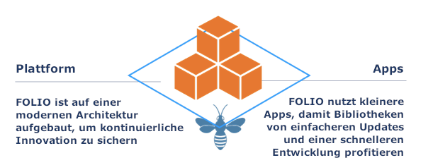

---
title: "Willkommen"
linkTitle: "Startseite"
weight: 10

---

{}
Dies ist die Dokumentation der Juniper-Version von FOLIO. Im Release-Menü wechseln Sie bei Bedarf in die gewünschte Version.
{}

Willkommen zur FOLIO-Dokumentation. FOLIO ist ein Open-Source-Projekt, das einen Paradigmenwechsel bei der Zusammenarbeit von Bibliotheken, Entwicklungsteams und Firmen darstellt. Diese offene Plattform bringt den Markt weit jenseits traditioneller Bibliotheksmanagementsysteme und eröffnet den Bibliotheken mehr Auswahl bei Funkionalität und Service.

## Ein modernes Bibliotheksökosystem

Das FOLIO-Projekt zielt darauf ab, eine nachhaltige, von der Gemeinschaft getragene Zusammenarbeit bei der Schaffung eines modernen Technologie-Ökosystems zu ermöglichen, das Bibliotheken durch Open-Source-Anwendungen bei der Verwaltung von Bibliotheksressourcen unterstützt und einen Mehrwert schafft.

### Zusammenarbeit in der Gemeinschaft

Vorangetrieben wird die Entwicklung der FOLIO-Plattform durch die transparente Zusammenarbeit von Bibliothekaren, Entwicklern und Anbietern. Der Product Council überwacht die Entwicklung der Plattform, in ihm sind viele der beteiligten Institutionen und Organisationen vertreten. Eine umfassende Auswahl an Kommunikationskanälen unterstützt die kontinuierlichen Abstimmungsprozesse, um das Projekt voranzutreiben.

## Die Zukunft ist da: Eine Open-Source-Bibliotheksplattform

FOLIO ist eine Open-Source-Plattform für Bibliotheksdienste, die von Bibliotheken, Anbietern und Entwicklern entwickelt wurde, die gemeinsam an der Neugestaltung von Bibliothekssoftware arbeiten. Die Zusammenarbeit ermöglicht es Bibliothekaren und Anbietern gleichermaßen, funktionales Fachwissen und Entwickler in jedem Bereich der Bibliotheksarbeitsabläufe beizusteuern. Aufgrund des Open-Source-Charakters der Plattform und der Auswahl an Dienstleistern können Bibliotheken die Bereitstellung erweiterbarer oder verbesserter Software beschleunigen und die Erweiterungen der Gemeinschaft zur Verfügung stellen, ohne sich auf die Roadmap eines bestimmten Anbieters verlassen zu müssen.
